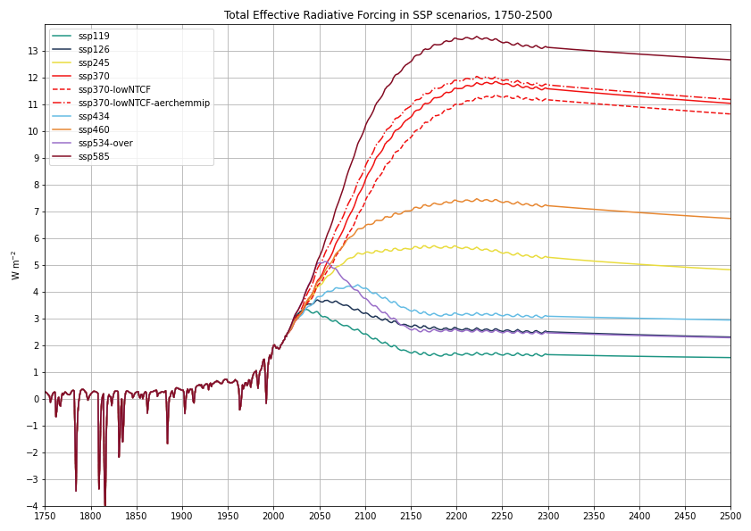
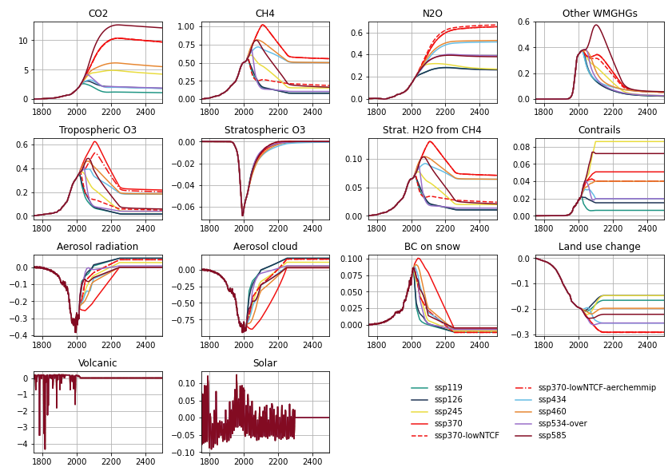

# ssp_erf
Effective radiative forcing time series from the Shared Socioeconomic Pathways.

14 components included, largely based on the components reported in the [IPCC's Fifth Assessment Report Annex II](https://www.ipcc.ch/site/assets/uploads/2017/09/WG1AR5_AnnexII_FINAL.pdf) forcing time series, with additional granularity (CH4 and N2O reported individually, and aerosol-radiation and aerosol-cloud interactions also reported individually).

The baseline year used is 1750 and forcings are reported until 2500.

## Total ERF

## ERF by component

## Data License

The data is distributed under the CC-BY-4.0 license (https://creativecommons.org/licenses/by/4.0/).

## Citation
For now please cite the Zenodo DOI. A suggested citation is on the Zenodo dataset page (see button above). It is important to include the version number of the dataset in the citation.

A paper has been submitted that describes the aerosol forcing component in detail:

C. J. Smith, G. Harris, M. D. Palmer, N. Bellouin, G. Myhre, M. Schulz, J.-C. Golaz, M. Ringer, T. Storelvmo and P. M. Forster, Energy Budget Constraints on the Time History of Aerosol Forcing and Climate Sensitivity, submitted.

The one difference between this submitted paper and the aerosol forcing time series used here is that this dataset scales up the aerosol forcing by approximately 6% so that the 2005-14 mean aerosol ERF is -1.2 W m-2.

## Frequently Asked Questions

### Why is the ERF in these time series in 2100 higher than the scenario nameplate?
Eagle-eyed viewers will notice that SSP5-8.5 has an ERF of about 10 W m-2 in 2100, and most SSPs behave this way in this dataset. The nameplate SSP radiative forcings are described in [Gidden et al. (2019)](https://gmd.copernicus.org/articles/12/1443/2019/) and the differences result from 

  1. the update of some greenhouse gas radiative forcing relationships
  2. going from radiative forcing to effective radiative forcing
  3. the different components reported here compared to the SSP dataset
  4. a different treatment in aerosol forcing.

All four components result in positive changes to the forcing reported in this time series:
  
  1. Greenhouse gas radiative forcings in the SSPs in [Gidden et al. (2019)](https://gmd.copernicus.org/articles/12/1443/2019/) were calculated from integrated assessment modelling pathways using the MAGICC6 simple climate model. MAGICC6 used greenhouse-gas concentration to radiative forcing relationships from [Myhre et al. (2013)](https://www.ipcc.ch/site/assets/uploads/2018/02/WG1AR5_Chapter08_FINAL.pdf), whereas here we use the newer [Etminan et al. (2016)](https://agupubs.onlinelibrary.wiley.com/doi/full/10.1002/2016GL071930) radiative forcing that is an increase in radiative forcing of about 2% for CO2 and 25% for CH4.
  2. Tropospheric rapid adjustments are included in the definition of effective radiative forcing. For CO2, the land-surface warming adds an additional 5%, whereas for CH4, the previously neglected shortwave forcing leads to tropospheric heating and changes in clouds, reducing CH4 forcing by 14% (but less than the increase in (1)). In most scenarios, CO2 forcing is much larger than CH4 forcing and the definition of ERF compared to RF is a net positive change.
  3. Generally, aerosol forcing projections are less negative in the future in this time series than they are in [Gidden et al. (2019)](https://gmd.copernicus.org/articles/12/1443/2019/). The method here is trained on GCM projections of SSP2-4.5 and found to match well; we don't know how well they would match GCM projections from other scenarios as the required experiments are not available.
  4. We report ERF from aviation contrails whereas the SSPs do not (addition of a small positive forcing), and we do not report ERF from mineral dust whereas the SSPs do (the omission of a negative forcing).
  
Generally, (1) and (2) are the sources of the greatest differences in high forcing scenarios, and (3) and (4) in low forcing scenarios.

### Why is volcanic forcing not zero in 1750?
We use a baseline of the last 2500 years of stratospheric aerosol optical depth (SAOD) from [Toohey & Sigl (2017)](https://essd.copernicus.org/articles/9/809/2017/), from which volcanic forcing is calculated using a linear relationship.  We define zero forcing to be the long-term mean SAOD in this time series. Because of periodic volcanic eruptions that produce spikes of strong negative forcing, the volcanic forcing in quiescent years is a small positive number to make the time average zero. This is done to ensure that long-term equilibrium temperauture anomalies are zero when running with only volcanic forcing. It also ensures a seamless transition to the SSPs, where future volcanic forcing is defined to be zero (i.e. equal to the long term average).

If we used the reference for zero forcing to be either zero SAOD or the background SAOD, we would end up with a spurious long-term cooling trend when this time series is applied to an energy balance model. 
